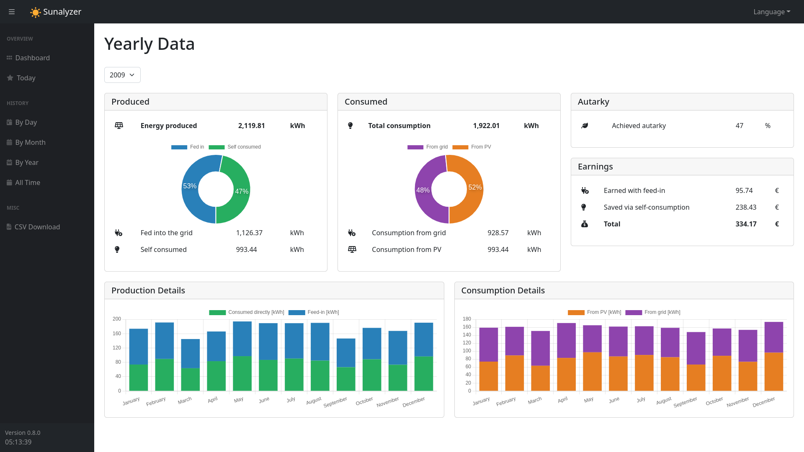

# ☀️ LambdaCast


**LambdaCast** is a self-hosted, vendor-independent solar PV monitoring and forecasting platform. It collects real-time data from your inverters, stores it locally, and serves a modern web dashboard — plus ML-powered hourly and daily production forecasts driven by live weather data.



---

## Table of Contents

- [Features](#features)
- [Supported Devices](#supported-devices)
- [Architecture Overview](#architecture-overview)
- [Getting Started](#getting-started)
  - [Docker Compose (recommended)](#docker-compose-recommended)
  - [Local Development](#local-development)
- [Configuration](#configuration)
- [Environment Files](#environment-files)
- [iSolarCloud Setup](#isolarcloud-setup)
- [ML Forecasting](#ml-forecasting)
- [API Reference](#api-reference)
- [Running Tests](#running-tests)
- [Contributing](#contributing)
- [Maintainers](#maintainers)

---

## Features

- **Real-time monitoring** — live power produced, consumed, grid draw, feed-in, and autarky
- **Historical data** — day/month/year resolution with 1-minute high-resolution storage (~15 MB/year)
- **ML-powered forecasting** — hourly and daily PV output forecasts using XGBoost and ARX models, fed by live Open-Meteo weather data (no API key needed)
- **PVGIS integration** — theoretical yield estimates from the EU Commission PVGIS API v5.2, with automatic caching
- **Multi-user platform** — each user manages their own installations; admins see the full fleet
- **Interactive maps** — GeoJSON-based fleet maps for both users and admins
- **Admin panel** — user management, organization management, fleet statistics, and installation reassignment
- **Earnings tracking** — configurable grid price and feed-in tariff for savings calculations
- **100% self-hosted** — no cloud dependency; all data stays on your hardware

---

## Supported Devices

| Device | Protocol | Notes |
|---|---|---|
| **Fronius** (Symo / Gen24) | HTTP REST (Solar API v1) | Local network polling |
| **Sunsynk / Deye** hybrid | Solarman V5 (TCP) or Modbus RTU | WiFi dongle or USB-RS485 adapter |
| **iSolarCloud** (Sungrow) | OAuth2 → REST | Requires the bundled FastAPI bridge service |
| **Dummy** | — | Generates synthetic data for testing |

Contributions adding new device integrations are welcome — see [Contributing](#contributing).

---

## Architecture Overview

```
┌─────────────────────────────────────────┐
│           Docker Host                   │
│                                         │
│  ┌──────────────────────────────────┐   │
│  │  lambdacast  (port 8020→5000)    │   │
│  │  ┌───────────┐ ┌──────────────┐  │   │
│  │  │ Flask API │ │  Grabber     │  │   │
│  │  │ + Waitress│ │  (Supervisor)│  │   │
│  │  └───────────┘ └──────────────┘  │   │
│  │  SQLite: platform.db             │   │
│  │  SQLite: db_<id>.sqlite (×N)     │   │
│  │  ML models: models/              │   │
│  └──────────────────────────────────┘   │
│                                         │
│  ┌──────────────────────────────────┐   │
│  │  isolarcloud-bridge (port 8000)  │   │
│  │  FastAPI OAuth2 bridge           │   │
│  └──────────────────────────────────┘   │
└─────────────────────────────────────────┘
```

- **Flask + Waitress** serves both the REST API and the static frontend
- **Supervisor** manages the web server and data grabber as concurrent processes
- **platform.db** stores users, organizations, and installation metadata
- **db_\<id\>.sqlite** per-installation telemetry databases (bootstrapped automatically)
- **ML models** are loaded lazily and scale predictions to each installation's configured capacity

---

## Getting Started

### Docker Compose (recommended)

**Prerequisites:** Docker Engine and Docker Compose.

1. Clone the repository:

   ```bash
   git clone https://github.com/your-org/LambdaCast.git
   cd LambdaCast
   ```

2. Set up your environment files:

   ```bash
   cp .env.example .env
   cp .env.isolarcloud.example .env.isolarcloud
   # Edit both files with your credentials
   ```

3. Create your configuration file (if not already present):

   ```bash
   # Edit data/config.yml to match your device setup
   ```

4. Start the stack:

   ```bash
   docker compose up -d
   ```

5. Open your browser at `http://localhost:8020` and log in with the admin credentials from your `.env`.

> The `data/` folder is mounted as a Docker volume. Back it up regularly — it contains your databases, config, and logs.

---

### Local Development

```bash
# Install dependencies
pip install -r requirements.txt

# Run the server
cd backend
python server.py
```

The server reads `data/config.yml` and starts on `http://localhost:5000`.

---

## Configuration

LambdaCast is configured via `data/config.yml`. A minimal example:

```yaml
logging: normal          # normal | verbose

time_zone: "Africa/Tunis"

devices:
  1:                     # installation_id → device mapping
    type: Fronius
    host_name: 192.168.1.100
    has_meter: true

prices:
  price_per_grid_kwh: 0.30
  revenue_per_fed_in_kwh: 0.10

server:
  ip: 0.0.0.0
  port: 5000

grabber:
  interval_s: 5          # how often to poll the inverter (seconds)
```

### Fronius device config

```yaml
devices:
  1:
    type: Fronius
    host_name: 192.168.1.100   # IP or hostname of your inverter
    has_meter: true             # Is a Fronius Smart Meter present?
```

### Sunsynk / Deye device config

```yaml
devices:
  1:
    type: Sunsynk
    connection: solarman        # solarman (WiFi dongle) or modbus_rtu (RS485)
    host_name: 192.168.1.101
    logger_serial: "1234567890"
```

For `modbus_rtu`, replace `host_name`/`logger_serial` with `serial_port`, `baudrate`, `parity`, etc. See the full register map and wiring notes in [backend/devices/Sunsynk.py](backend/devices/Sunsynk.py).

---

## Environment Files

LambdaCast uses two environment files for secrets. Example templates are provided — copy them and fill in your values:

```bash
cp .env.example .env
cp .env.isolarcloud.example .env.isolarcloud
```

Both files are git-ignored so secrets never end up in version control.

### `.env` — main application

| Variable | Default | Description |
|---|---|---|
| `SUNALYZER_ADMIN_USER` | `admin` | Initial admin username |
| `SUNALYZER_ADMIN_EMAIL` | `admin@lambdacast.local` | Initial admin email |
| `SUNALYZER_ADMIN_PASSWORD` | `changeme123` | Initial admin password — **change this** |
| `SUNALYZER_SECRET_KEY` | `lambdacast-change-me-in-production` | JWT signing key — **change this** |
| `TOKEN_LIFETIME_S` | `86400` | JWT token lifetime in seconds (default 24 h) |

> Generate a secure secret key with: `python -c "import secrets; print(secrets.token_hex(32))"`

### `.env.isolarcloud` — iSolarCloud bridge

Get your credentials from the [iSolarCloud developer portal](https://developer.isolarcloud.com) by creating an application there.

| Variable | Description |
|---|---|
| `ISOLARCLOUD_APP_KEY` | OAuth application key from the developer portal |
| `ISOLARCLOUD_SECRET_KEY` | OAuth secret key from the developer portal |
| `ISOLARCLOUD_APP_ID` | Application ID from the developer portal |
| `BRIDGE_REDIRECT_URI` | OAuth callback URL — must match your portal registration (e.g. `http://192.168.1.50:8000/callback`) |
| `TOKEN_FILE` | Token persistence path inside the container (default: `/data/isolarcloud_token.json`) |
| `ISOLARCLOUD_PLANT_ID` | Your plant ID — find it via `GET /api/plants` after first OAuth login |

Reference both files from `docker-compose.yml`:

```yaml
services:
  lambdacast:
    env_file: .env
    ...
  isolarcloud-bridge:
    env_file: .env.isolarcloud
    ...
```

---

## iSolarCloud Setup

The iSolarCloud (Sungrow) integration uses an OAuth2 bridge that runs as a separate Docker service.

1. Fill in `.env.isolarcloud` with your developer portal credentials (see [Environment Files](#environment-files))
2. Start the stack: `docker compose up -d`
3. Watch the bridge logs and copy the OAuth authorization URL:
   ```bash
   docker compose logs -f isolarcloud-bridge
   ```
4. Open the URL in a browser, log in to iSolarCloud, and authorize. The token is saved to `data/isolarcloud_token.json` and reused on subsequent restarts — no browser action needed after the first time.
5. Seed the initial installation:
   ```bash
   docker compose --profile tools run --rm seed
   ```

---

## ML Forecasting

LambdaCast ships two trained models in `models/`:

| Model | File | Algorithm |
|---|---|---|
| ARX | `arx_model.pkl` | AutoRegressive with exogenous variables (30 lags) |
| XGBoost | `xgb_PV1_Power_W_1.joblib` | XGBoost Regressor |

Both models consume 9 weather features fetched live from [Open-Meteo](https://open-meteo.com) (free, no API key required):  
`Solar Radiation`, `Temperature`, `Dew Point`, `Wind Speed`, `Wind Direction`, `Humidity`, `Rain`, `PM2.5`, `PM10`

Predictions are automatically **capacity-scaled** at runtime: the model's trained peak output is estimated and scaled proportionally to each installation's configured `installed_capacity_kwp`.

**Forecast API example:**

```
GET /api/installations/1/forecast?model=xgb_PV1_Power_W_1&date=2026-09-22
```

Returns hourly predictions, daily totals, and peak hour for the selected date.

The training notebook is at `models/6_ARX.ipynb`. Drop additional `.joblib` or `.pkl` files into `models/` and they will be auto-discovered via `GET /api/installations/forecast/models`.

---

## API Reference

All routes require a JWT token sent as a `Bearer` header or an `access_token` HttpOnly cookie (set automatically on login).

### Auth

| Method | Route | Description |
|---|---|---|
| `POST` | `/api/auth/register` | Create a new user account |
| `POST` | `/api/auth/login` | Login — returns JWT and sets auth cookie |
| `POST` | `/api/auth/logout` | Logout — clears auth cookie |
| `GET` | `/api/auth/me` | Get current user profile |

### Installations

| Method | Route | Description |
|---|---|---|
| `GET` | `/api/installations` | List own installations |
| `POST` | `/api/installations` | Create an installation |
| `PATCH` | `/api/installations/<id>` | Update an installation |
| `DELETE` | `/api/installations/<id>` | Delete an installation |
| `GET` | `/api/installations/<id>/pvgis` | PVGIS yield estimate (cached) |
| `POST` | `/api/installations/<id>/pvgis/refresh` | Force PVGIS cache refresh |
| `GET` | `/api/installations/<id>/forecast` | Run an ML forecast (`?model=&date=`) |
| `GET` | `/api/installations/forecast/models` | List available ML models |
| `GET` | `/api/installations/map` | GeoJSON map of own installations |
| `POST` | `/api/installations/<id>/device` | Configure inverter device |

### Admin

| Method | Route | Description |
|---|---|---|
| `GET` | `/api/admin/users` | List all users |
| `POST` | `/api/admin/users` | Create a user |
| `PATCH` | `/api/admin/users/<id>` | Update role / status |
| `POST` | `/api/admin/users/<id>/reset-password` | Reset a user's password |
| `GET` | `/api/admin/installations` | Fleet-wide installation list |
| `PATCH` | `/api/admin/installations/<id>/assign` | Reassign installation to another user |
| `GET` | `/api/admin/installations/map` | GeoJSON fleet map |
| `GET` | `/api/admin/solar-statistics` | Aggregated fleet statistics |
| `GET` | `/api/admin/organizations` | List organizations |
| `POST` | `/api/admin/organizations` | Create an organization |

---

## Running Tests

```bash
pytest
```

Tests live in `pytest/` and cover auth, installation CRUD, the grabber, device drivers (Dummy, Sunsynk), PVGIS (with HTTP mocking), and the platform database layer.

---

## Contributing

Bug reports and pull requests are welcome. To add support for a new inverter:

1. Create a new file in `backend/devices/` following the pattern of `backend/devices/Fronius.py`
2. Register the device type in `DEVICE_REGISTRY` inside `backend/routes/installation_routes.py`
3. Add unit tests in `pytest/`
4. Open a pull request with a description of the device and test hardware used

For larger changes, open an issue first to discuss the approach.

---

## Maintainers

LambdaCast is maintained by the project team.

See [LICENSE](LICENSE) for licensing terms.
