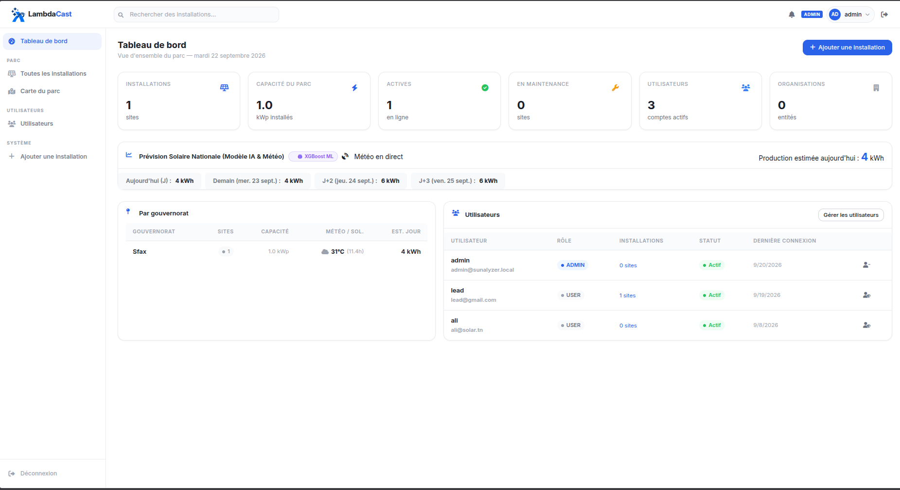
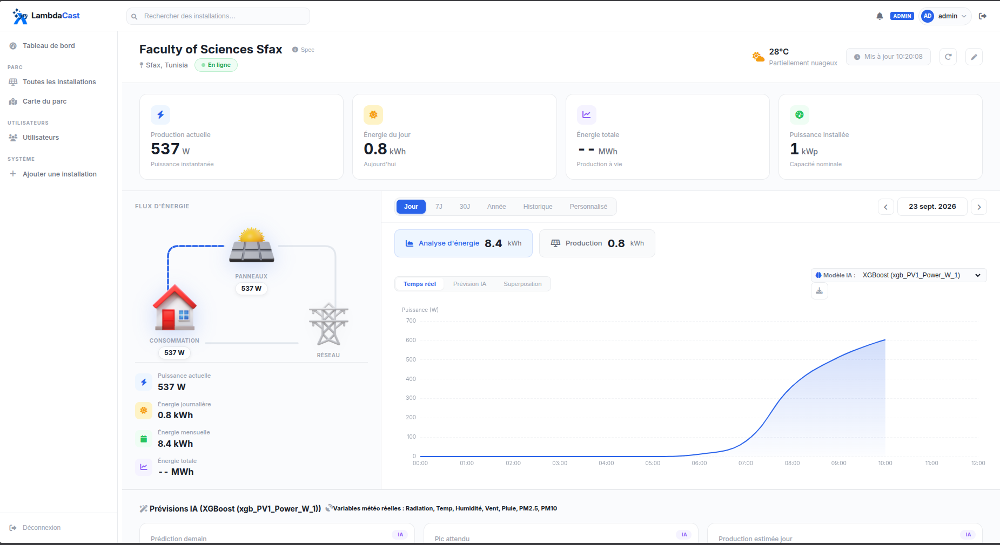

# ☀️ LambdaCast


**LambdaCast** est une plateforme nationale intelligente de prévision de la production photovoltaïque en toiture, développée dans le cadre de la **Track 1 — Plateforme Nationale Intelligente de Prévision de la Production Solaire en Toiture**.

Face à la croissance rapide des installations photovoltaïques décentralisées en Tunisie, cette plateforme exploite des données météorologiques, des informations sur les parcs solaires installés et des modèles d'intelligence artificielle avancés pour prévoir la production PV à différentes échelles spatiales et temporelles — du district au niveau national — et fournir au Dispatching National une vision fiable de la production attendue.




---

## Table des matières

- [Contexte](#contexte)
- [Fonctionnalités](#fonctionnalités)
- [Appareils supportés](#appareils-supportés)
- [Architecture](#architecture)
- [Démarrage rapide](#démarrage-rapide)
  - [Docker Compose (recommandé)](#docker-compose-recommandé)
  - [Développement local](#développement-local)
- [Configuration](#configuration)
- [Fichiers d'environnement](#fichiers-denvironnement)
- [Configuration iSolarCloud](#configuration-isolarcloud)
- [Prévision IA](#prévision-ia)
- [Référence API](#référence-api)
- [Tests](#tests)
- [Contribuer](#contribuer)

---

## Contexte

Le développement des installations photovoltaïques en toiture connaît une croissance soutenue en Tunisie, aussi bien dans les secteurs résidentiel, tertiaire qu'industriel. Réparties sur l'ensemble du territoire national et raccordées aux réseaux basse et moyenne tension, ces installations constituent une source de production décentralisée dont l'impact sur l'exploitation du système électrique devient significatif.

Cette production, variable par nature et directement dépendante des conditions météorologiques, influence la courbe de charge observée par le réseau et modifie les besoins en réserves, en flexibilité et en programmation des moyens de production.

LambdaCast répond à ce besoin en fournissant à la **STEG** et au **Dispatching National** :

- des prévisions à court terme (intra-journalières et de J à J+3)
- à plusieurs niveaux géographiques (district, gouvernorat, national)
- avec évaluation de l'incertitude associée
- et des tableaux de bord interactifs pour l'aide à la décision

---

## Fonctionnalités

- **Surveillance en temps réel** — puissance produite, consommée, injectée sur le réseau, soutirage et taux d'autarcie
- **Données historiques** — résolution jour/mois/année avec archivage haute résolution à la minute
- **Prévision PV par IA** — prévisions horaires et journalières via modèles XGBoost et ARX, alimentés par les données météo live d'Open-Meteo (sans clé API)
- **Plateforme multi-utilisateurs** — chaque utilisateur gère ses propres installations ; les administrateurs voient l'ensemble du parc
- **Cartes interactives** — vues cartographiques GeoJSON par utilisateur et au niveau de la flotte
- **Panneau d'administration** — gestion des utilisateurs, des organisations, statistiques du parc, réaffectation des installations
- **Suivi économique** — calcul des économies et revenus selon les tarifs d'achat et de revente configurables
- **100 % auto-hébergé** — aucune dépendance cloud ; toutes les données restent sur votre infrastructure

---

## Appareils supportés

| Appareil | Protocole | Remarques |
|---|---|---|
| **Fronius** (Symo / Gen24) | HTTP REST (Solar API v1) | Interrogation sur le réseau local |
| **Sunsynk / Deye** hybride | Solarman V5 (TCP) ou Modbus RTU | Dongle WiFi ou adaptateur USB-RS485 |
| **iSolarCloud** (Sungrow) | OAuth2 → REST | Nécessite le service bridge FastAPI inclus |
| **Dummy** | — | Génère des données synthétiques pour les tests |

Les contributions pour l'ajout de nouveaux onduleurs sont les bienvenues — voir [Contribuer](#contribuer).

---

## Architecture

```
┌──────────────────────────────────────────────────┐
│                   Hôte Docker                    │
│                                                  │
│  ┌────────────────────────────────────────────┐  │
│  │   lambdacast  (port 8020 → 5000)           │  │
│  │   ┌─────────────┐  ┌─────────────────────┐ │  │
│  │   │  Flask API  │  │  Grabber            │ │  │
│  │   │  + Waitress │  │  (Supervisor)       │ │  │
│  │   └─────────────┘  └─────────────────────┘ │  │
│  │   SQLite : platform.db                     │  │
│  │   SQLite : db_<id>.sqlite (×N)             │  │
│  │   Modèles ML : models/                     │  │
│  └────────────────────────────────────────────┘  │
│                                                  │
│  ┌────────────────────────────────────────────┐  │
│  │   isolarcloud-bridge  (port 8000)          │  │
│  │   Bridge OAuth2 FastAPI                    │  │
│  └────────────────────────────────────────────┘  │
└──────────────────────────────────────────────────┘
```

- **Flask + Waitress** expose l'API REST et sert les fichiers statiques du frontend
- **Supervisor** gère le serveur web et le grabber de données comme deux processus concurrents
- **platform.db** stocke les utilisateurs, organisations et métadonnées des installations
- **db_\<id\>.sqlite** base de données de télémétrie par installation, initialisée automatiquement
- **Modèles ML** chargés à la demande et mis à l'échelle selon la capacité installée de chaque site

---

## Démarrage rapide

### Docker Compose (recommandé)

**Prérequis :** Docker Engine et Docker Compose.

1. Cloner le dépôt :

   ```bash
   git clone https://github.com/your-org/LambdaCast.git
   cd LambdaCast
   ```

2. Préparer les fichiers d'environnement :

   ```bash
   cp .env.example .env
   cp .env.isolarcloud.example .env.isolarcloud
   # Éditer les deux fichiers avec vos valeurs
   ```

3. Vérifier la configuration dans `data/config.yml` (appareils, prix, fuseau horaire).

4. Lancer la stack :

   ```bash
   docker compose up -d
   ```

5. Ouvrir `http://localhost:8020` dans un navigateur et se connecter avec les identifiants admin définis dans `.env`.

> Le dossier `data/` est monté comme volume Docker. Sauvegardez-le régulièrement — il contient vos bases de données, votre configuration et vos logs.

---

### Développement local

```bash
# Installer les dépendances
pip install -r requirements.txt

# Lancer le serveur
cd backend
python server.py
```

Le serveur lit `data/config.yml` et démarre sur `http://localhost:5000`.

---

## Configuration

LambdaCast se configure via `data/config.yml`. Exemple minimal :

```yaml
logging: normal          # normal | verbose

time_zone: "Africa/Tunis"

devices:
  1:                     # installation_id → type d'appareil
    type: Fronius
    host_name: 192.168.1.100
    has_meter: true

prices:
  price_per_grid_kwh: 0.341       # Prix d'achat réseau (TND/kWh)
  revenue_per_fed_in_kwh: 0.115   # Tarif d'injection (TND/kWh)

server:
  ip: 0.0.0.0
  port: 5000

grabber:
  interval_s: 5          # Intervalle d'interrogation de l'onduleur (secondes)
```

### Configuration Fronius

```yaml
devices:
  1:
    type: Fronius
    host_name: 192.168.1.100   # IP ou nom d'hôte de l'onduleur
    has_meter: true             # Compteur Fronius Smart Meter présent ?
```

### Configuration Sunsynk / Deye

```yaml
devices:
  1:
    type: Sunsynk
    connection: solarman        # solarman (dongle WiFi) ou modbus_rtu (RS485)
    host_name: 192.168.1.101
    logger_serial: "1234567890"
```

Pour `modbus_rtu`, remplacer `host_name`/`logger_serial` par `serial_port`, `baudrate`, `parity`, etc. Voir la carte des registres et les notes de câblage dans [backend/devices/Sunsynk.py](backend/devices/Sunsynk.py).

---

## Fichiers d'environnement

LambdaCast utilise deux fichiers d'environnement pour les secrets. Des templates sont fournis — les copier et compléter avant le premier lancement :

```bash
cp .env.example .env
cp .env.isolarcloud.example .env.isolarcloud
```

Ces fichiers sont dans `.gitignore` et ne seront jamais commités.

### `.env` — application principale

| Variable | Défaut | Description |
|---|---|---|
| `SUNALYZER_ADMIN_USER` | `admin` | Nom d'utilisateur admin initial |
| `SUNALYZER_ADMIN_EMAIL` | `admin@lambdacast.local` | Email admin initial |
| `SUNALYZER_ADMIN_PASSWORD` | `changeme123` | Mot de passe admin — **à changer** |
| `SUNALYZER_SECRET_KEY` | `lambdacast-change-me-in-production` | Clé de signature JWT — **à changer** |
| `TOKEN_LIFETIME_S` | `86400` | Durée de vie du token JWT en secondes (24 h par défaut) |

> Générer une clé sécurisée : `python -c "import secrets; print(secrets.token_hex(32))"`

### `.env.isolarcloud` — bridge iSolarCloud

Les identifiants sont obtenus depuis le [portail développeur iSolarCloud](https://developer.isolarcloud.com) en créant une application.

| Variable | Description |
|---|---|
| `ISOLARCLOUD_APP_KEY` | Clé d'application OAuth du portail développeur |
| `ISOLARCLOUD_SECRET_KEY` | Clé secrète OAuth du portail développeur |
| `ISOLARCLOUD_APP_ID` | Identifiant d'application du portail développeur |
| `BRIDGE_REDIRECT_URI` | URL de callback OAuth — doit correspondre à l'enregistrement dans le portail (ex. `http://192.168.1.50:8000/callback`) |
| `TOKEN_FILE` | Chemin de persistance du token dans le conteneur (défaut : `/data/isolarcloud_token.json`) |
| `ISOLARCLOUD_PLANT_ID` | Identifiant de la centrale — disponible via `GET /api/plants` après la première connexion OAuth |

Référencer les deux fichiers dans `docker-compose.yml` :

```yaml
services:
  lambdacast:
    env_file: .env
  isolarcloud-bridge:
    env_file: .env.isolarcloud
```

---

## Configuration iSolarCloud

L'intégration iSolarCloud (Sungrow) utilise un bridge OAuth2 qui tourne comme service Docker séparé.

1. Renseigner `.env.isolarcloud` avec les identifiants du portail développeur
2. Lancer la stack : `docker compose up -d`
3. Surveiller les logs du bridge et copier l'URL d'autorisation OAuth :
   ```bash
   docker compose logs -f isolarcloud-bridge
   ```
4. Ouvrir l'URL dans un navigateur, se connecter à iSolarCloud et autoriser l'accès. Le token est sauvegardé dans `data/isolarcloud_token.json` et réutilisé automatiquement aux redémarrages suivants.
5. Initialiser l'installation :
   ```bash
   docker compose --profile tools run --rm seed
   ```

---

## Prévision IA

LambdaCast intègre deux modèles entraînés dans `models/` :

| Modèle | Fichier | Algorithme |
|---|---|---|
| ARX | `arx_model.pkl` | AutoRégressif avec variables exogènes (30 retards) |
| XGBoost | `xgb_PV1_Power_W_1.joblib` | Régresseur XGBoost |

Les deux modèles consomment 9 variables météorologiques récupérées en direct depuis [Open-Meteo](https://open-meteo.com) (gratuit, sans clé API) :
`Rayonnement solaire`, `Température`, `Point de rosée`, `Vitesse du vent`, `Direction du vent`, `Humidité`, `Pluie`, `PM2.5`, `PM10`

Les prédictions sont **mises à l'échelle automatiquement** à l'exécution : le pic estimé du modèle est recalculé proportionnellement à la capacité installée (`installed_capacity_kwp`) de chaque installation cible.

**Exemple d'appel API prévision :**

```
GET /api/installations/1/forecast?model=xgb_PV1_Power_W_1&date=2026-09-22
```

Retourne les prévisions horaires, les totaux journaliers et l'heure de pic pour la date sélectionnée.

Le notebook d'entraînement est disponible dans `models/6_ARX.ipynb`. Tout fichier `.joblib` ou `.pkl` déposé dans `models/` est découvert automatiquement via `GET /api/installations/forecast/models`.

---

## Référence API

Toutes les routes nécessitent un token JWT transmis en header `Bearer` ou via le cookie HttpOnly `access_token` (positionné automatiquement à la connexion).

### Authentification

| Méthode | Route | Description |
|---|---|---|
| `POST` | `/api/auth/register` | Créer un compte utilisateur |
| `POST` | `/api/auth/login` | Connexion — retourne le JWT et pose le cookie |
| `POST` | `/api/auth/logout` | Déconnexion — efface le cookie |
| `GET` | `/api/auth/me` | Profil de l'utilisateur courant |

### Installations

| Méthode | Route | Description |
|---|---|---|
| `GET` | `/api/installations` | Lister ses installations |
| `POST` | `/api/installations` | Créer une installation |
| `PATCH` | `/api/installations/<id>` | Modifier une installation |
| `DELETE` | `/api/installations/<id>` | Supprimer une installation |
| `GET` | `/api/installations/<id>/pvgis` | Estimation PVGIS (mise en cache) |
| `POST` | `/api/installations/<id>/pvgis/refresh` | Forcer le recalcul PVGIS |
| `GET` | `/api/installations/<id>/forecast` | Lancer une prévision ML (`?model=&date=`) |
| `GET` | `/api/installations/forecast/models` | Lister les modèles ML disponibles |
| `GET` | `/api/installations/map` | Carte GeoJSON des installations |
| `POST` | `/api/installations/<id>/device` | Configurer l'onduleur |

### Administration

| Méthode | Route | Description |
|---|---|---|
| `GET` | `/api/admin/users` | Lister tous les utilisateurs |
| `POST` | `/api/admin/users` | Créer un utilisateur |
| `PATCH` | `/api/admin/users/<id>` | Modifier rôle / statut |
| `POST` | `/api/admin/users/<id>/reset-password` | Réinitialiser un mot de passe |
| `GET` | `/api/admin/installations` | Vue globale du parc |
| `PATCH` | `/api/admin/installations/<id>/assign` | Réaffecter une installation |
| `GET` | `/api/admin/installations/map` | Carte GeoJSON du parc complet |
| `GET` | `/api/admin/solar-statistics` | Statistiques agrégées du parc |
| `GET` | `/api/admin/organizations` | Lister les organisations |
| `POST` | `/api/admin/organizations` | Créer une organisation |

---

## Tests

```bash
pytest
```

Les tests se trouvent dans `pytest/` et couvrent : l'authentification, le CRUD des installations, le grabber de données, les pilotes d'appareils (Dummy, Sunsynk), le service PVGIS (avec mock HTTP) et la couche base de données.

---

## Contribuer

Les rapports de bugs et les pull requests sont les bienvenus. Pour ajouter le support d'un nouvel onduleur :

1. Créer un fichier dans `backend/devices/` en suivant le modèle de `backend/devices/Fronius.py`
2. Enregistrer le nouveau type dans `DEVICE_REGISTRY` dans `backend/routes/installation_routes.py`
3. Ajouter des tests unitaires dans `pytest/`
4. Ouvrir une pull request avec une description de l'appareil et du matériel de test utilisé

Pour les changements plus importants, ouvrir d'abord une issue pour discuter de l'approche.

---

Voir [LICENSE](LICENSE) pour les conditions de licence.
